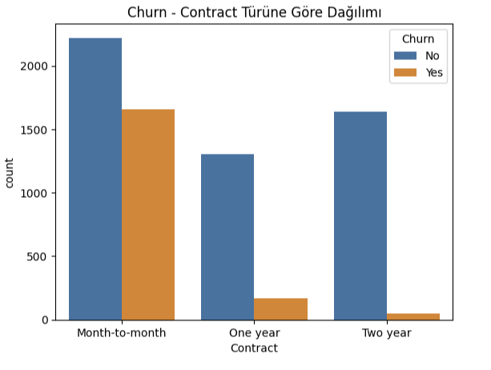
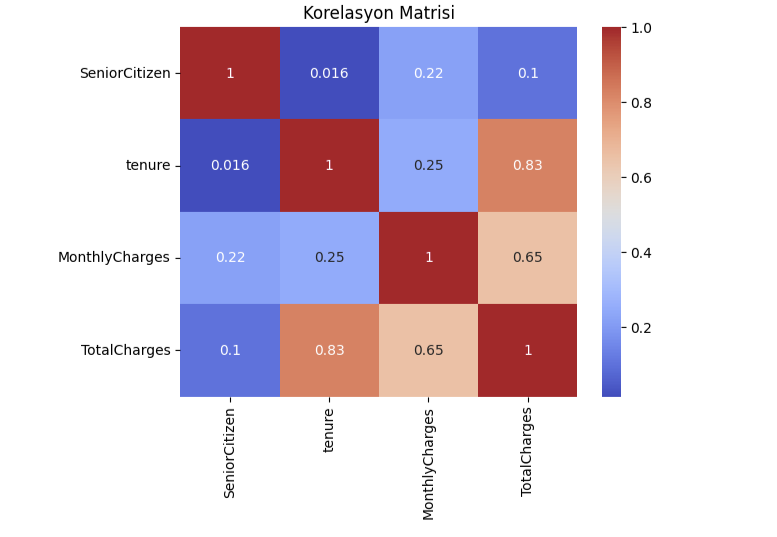
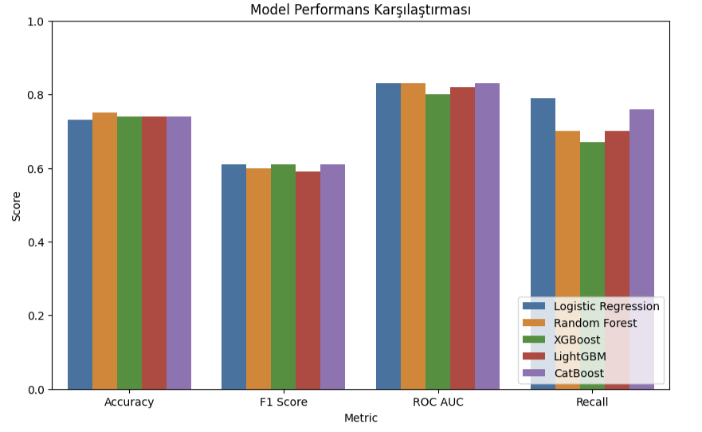
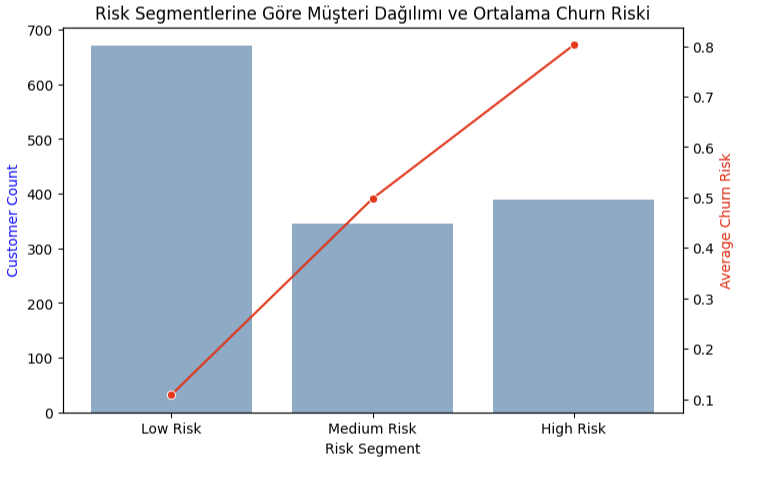
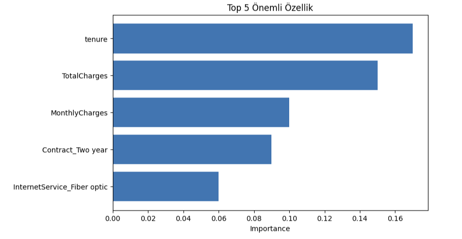

# 📊 Customer Churn Analysis and Prediction | (Python)

This project focuses on analyzing and predicting customer churn for a telecommunications company using Python. By leveraging machine learning models and data analysis techniques, the goal is to identify customers at risk of leaving and enable targeted retention strategies.

---

## 📌 Project Overview

This project aims to predict customer churn in a telecommunications company by analyzing customer data and applying various machine learning algorithms. The primary objective is to identify customers who are likely to leave and provide actionable insights to reduce churn rates through targeted interventions.

---

## 🛠️ Tools Used

| Tool             | Purpose                              |
|------------------------|--------------------------------------------|
| **Python**             | Data processing, analysis, and modeling    |
| **Jupyter Notebook**   | Interactive coding and documentation       |
| **Pandas & NumPy**     | Data manipulation and numerical computations|
| **Scikit-learn**       | Machine learning models and evaluation metrics |
| **CatBoost, XGBoost, LightGBM** | Gradient boosting algorithms for churn prediction |
| **Matplotlib & Seaborn** | Data visualization and plotting          |

---

## 📋 Methods Used
- Data preprocessing and encoding of categorical variables
- Train-test split for model evaluation
- Machine learning models including Logistic Regression, Random Forest, XGBoost, LightGBM, and CatBoost
- Model performance comparison using metrics such as Accuracy, F1-score, ROC AUC
- Customer segmentation and profiling based on churn risk
- Visualization of feature importance

---

## 🗂️ Repository Structure
- `churn_analysis.ipynb`: Jupyter Notebook containing the analysis and modeling steps
- `churn_analysis.py`: Python script version of the notebook for those who prefer running the analysis as a standard Python script in their local environment.
- `data/WA_Fn-UseC_-Telco-Customer-Churn.csv`: Dataset file (or data access details)
- `reports/`: Folder with project reports and visual outputs
- `README.md`: Project description and documentation

---

## 📈 Key Findings
- Customers in the high-risk segment have churn rates exceeding 80%.
- Customer tenure (length of service) is a strong factor reducing churn risk.
- CatBoost and LightGBM models performed best in predicting churn.
- The analysis supports targeted campaigns for high-risk customers to reduce churn.

---

## 💡 Recommendations

Based on the churn analysis and risk segmentation, the following actions are recommended to reduce customer churn and improve retention:

- **Target High-Risk Customers:** Implement personalized offers, discounts, and enhanced customer support for customers identified as high risk.  
- **Engage Medium-Risk Customers:** Develop loyalty programs and communication campaigns to encourage continued subscription and reduce churn risk.  
- **Maintain Low-Risk Customers:** Focus on sustaining satisfaction through quality service and regular feedback mechanisms to ensure long-term loyalty.  
- **Monitor and Update Models:** Continuously monitor churn patterns and update predictive models to adapt to changing customer behaviors.  
- **Leverage Feature Insights:** Use key factors such as customer tenure and contract type to inform business strategies and tailor interventions.

---

### 📁 Dataset Summary
- Customer demographic and usage data sourced from [Kaggle - Telco Customer Churn](https://www.kaggle.com/datasets/blastchar/telco-customer-churn?resource=download)  
- Approximately 7000 customer records with 20+ features.

---

## 📸 Screenshots

### Customer Churn Distribution by Contract Type


### Feature Correlation Matrix


### Model Performance Comparison Across Metrics


### Customer Distribution and Average Churn Risk by Risk Segment


### Top 5 Most Important Features Influencing Churn Prediction


---

## 🚀 How to Use

Clone the repository and open the notebook or run the script:

```bash
git clone https://github.com/seckinozler/python-churn-prediction-analysis.git
cd python-churn-prediction-analysis

# To run the Jupyter Notebook
jupyter notebook churn_analysis.ipynb

# To run the Python script
python churn_analysis.py
```
------

## 📬 Contact

- **GitHub:** [github.com/seckinozler](https://github.com/seckinozler)  
- **LinkedIn:** [linkedin.com/in/seckinozler](https://www.linkedin.com/in/seckinozler/)  
- **Website:** [seckinsafakozler.wixsite.com/portfolio](https://seckinsafakozler.wixsite.com/portfolio)

---

